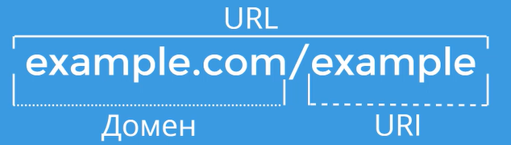

# Теория по курсу "Автоматизация тестирования REST API на Python"
Учебный сайт: https://playground.learnqa.ru/demo/api_call_example
Учебный API: https://playground.learnqa.ru/api/map

## 1.1 HTTP и API

Под тестированием может пониматься HTTP, REST API. RESTful, SOAP.

API - application programming interface - интерфейс для общения между приложениями.
GUI - графический интерфейс пользователя, CLI - интерфейс командной строки, API - тоже интерфейс, но для программ.
Когда тестировщик проверяет API, он проверяет одну из сторон общения. 

Протокол - договоренность между программами как отсылать и принимать информацию, и как её понимать. Самый простой пример протокола - сигнальные костры, азбука морзе. В протоколе важны две вещи: способ передачи и формат сигналов.

Модель OSI: 1 физический уровень, 2 канальный, 3 сетевой, 4 транспортный, 5 сеансовый, 6 уровень представления, 7 прикладной уровень.

HTTP является протоколом прикладного уровня (7) - передача текстовых данных в определенном формате. Структура HTTP довольно простая: включает в себя **URL**, **заголовки** и **тело запроса**. В ответ на запрос сервер присылает **код ответа**, **заголовки** и **тело ответа**. 
URI - часть адреса без домена.

Список запросов и параметров, которые имеют смысл для сервера, определяется API. API может использовать разные протоколы, в том числе HTTP. Если используется HTTP, то такой протокол называется HTTP API.

API:
- способ общения одной программы с другой - например, клиента с сервером;
- лиент создает HTTP запрос;
- сервер запросы обрабатывает и возвращает ответ;
- клиент может реагировать на ответ сервера.

## 1.2 Структура HTTP запроса

У GET запроса нет тела запроса, у запросов типа POST и остальных тело запроса может быть. GET запросы легче по трафику.
Методы HTTP отличаются, то, как обрабатываются запросы, может быть переопределено разработчиком бэкенда. Существует договоренность. В архитектуре REST - GET - для получение информации, POST - для передачи информации.

Код ответа (Status code) - ответ цифровой в интервале от 100 до 999. Информационные - от 100 до 1999, успешные - от 200 до 299, перенаправление - 300-399 (нету информации по URL), клиентские - 400-499 (не ожидал запроса от клиента), серверные - от 500-599 (в ходе обработки запроса произошла ошибка на стороне сервера).

API - это набор запросов. Сервер отвечает набором заголовков + возвращает ответ.
Как тестировщик узнает какие запросы нужно посылать? Попросить у разработчиков список запросов. Существует язык описание - swagger (open api specification).

## Homework

2. Про cookie:  https://developer.mozilla.org/en-US/docs/Web/HTTP/Headers/Cookie